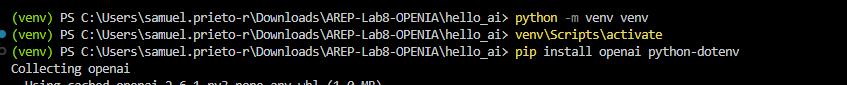
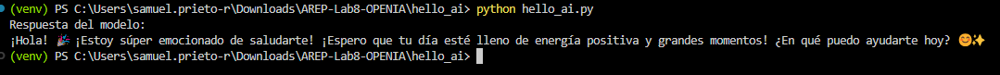
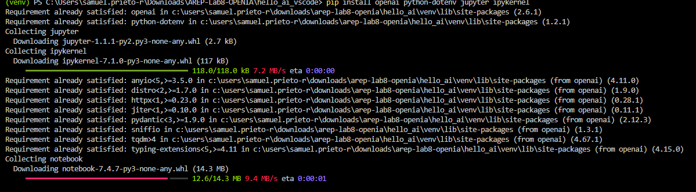
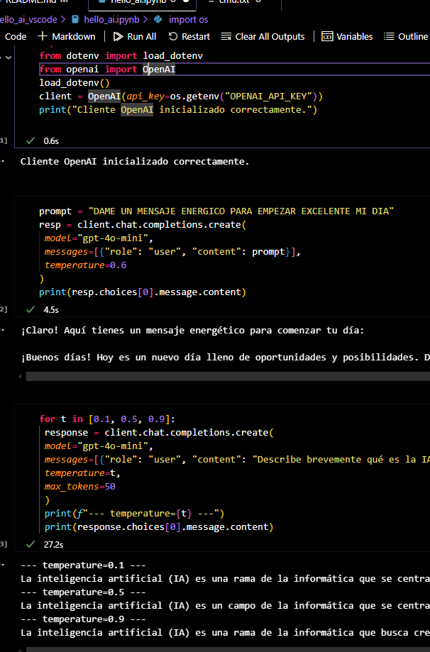

Perfecto 🌟 Aquí tienes **tu documento completo** (Guía 1 y Guía 2) con el mismo estilo limpio, uniforme y profesional que usé antes.
Ideal para tu informe o README 👇

---

# 🧠 AREP - Laboratorio 8: OpenAI

## **Guía 1 - Hello World AI con Python y la API de OpenAI**

---

### 🧩 **1. Creación del entorno virtual**

Primero, se crea un entorno virtual para aislar las dependencias del proyecto.

**Figura 1.** Creación del entorno virtual.

---

### 🔑 **2. Obtención de la llave de la API**

Se obtiene la **API Key** desde la cuenta de OpenAI, la cual será necesaria para autenticar las peticiones al modelo.

**Figura 2.** Obtención de la llave de la API desde OpenAI.

---

### ⚙️ **3. Configuración del archivo `.env`**

La clave de la API se almacena de forma segura en un archivo `.env` para proteger la información sensible.

**Figura 3.** Inserción de la API Key en el archivo `.env`.

---

### 💻 **4. Primer Script con OpenAI**

Se crea un script básico en Python para realizar la primera interacción con el modelo de OpenAI, comprobando que todo funcione correctamente.

**Figura 4.** Primer script con conexión a la API de OpenAI.

---

### 🧱 **5. Verificación del entorno virtual**

Se verifica que el entorno virtual esté correctamente:

* Generado
* Activado
* Con todas las dependencias instaladas

**Figura 5.** Comprobación del entorno virtual y sus dependencias.

---

### 🤖 **6. Prueba de interacción con la IA**

Finalmente, se ejecuta una prueba para verificar que la IA responde correctamente con un mensaje de saludo.

**Figura 6.** Respuesta exitosa de la IA.

---

✅ **Resultado:**
Se logró crear y configurar correctamente el entorno de desarrollo, conectar con la API de OpenAI y ejecutar el primer script exitosamente.

---

## **Guía 2 - Hello World AI en Jupyter Notebook con VS Code**

---

### ⚙️ **1. Requisitos previos**

Antes de comenzar, se debe contar con **Jupyter** instalado en el entorno de desarrollo para ejecutar notebooks dentro de VS Code.

**Figura 1.** Instalación de Jupyter en VS Code.

---

### 📁 **2. Creación del entorno y estructura del proyecto**

Se crea una carpeta de trabajo y dentro de ella un entorno virtual dedicado para el laboratorio.

**Figura 2.** Creación de la carpeta del proyecto.

**Figura 3.** Creación del entorno virtual.

---

### 📦 **3. Instalación de dependencias**

Se instalan las dependencias necesarias para ejecutar el proyecto y conectar con la API de OpenAI.

**Figura 4.** Instalación de dependencias en el entorno virtual.

---

### 🧮 **4. Instalación de dependencias desde el Notebook**

También es posible instalar las dependencias directamente desde una celda del archivo Jupyter Notebook.

**Figura 5.** Instalación de dependencias desde el notebook.

---

### 🔑 **5. Configuración del archivo `.env`**

La clave de la API se almacena de forma segura en el archivo `.env`, al igual que en la guía anterior, para mantener la seguridad de la información sensible.

**Figura 6.** Inserción de la API Key en el archivo `.env`.

---

### 📓 **6. Ejecución del código en Jupyter Notebook**

En el archivo Jupyter Notebook, se ingresan y ejecutan los bloques de código para interactuar con la API de OpenAI directamente desde las celdas.

**Figura 7.** Ejecución del código en celdas del notebook.

**Figura 8.** Resultados exitosos de la ejecución del notebook.

---

✅ **Resultado:**
Se logró configurar correctamente Jupyter Notebook en VS Code

---

## Guia 3
