# 🧠 **AREP - Laboratorio 8: OpenAI**

### **Hello World AI con Python y la API de OpenAI**

---

## 🏫 **Universidad Escuela Colombiana de Ingeniería Julio Garavito**

**Materia:** Arquitecturas Empresariales (AREP)
**Estudiante:** Alejandro Prieto
**Repositorio GitHub:** [github.com/AlejandroPrieto82](https://github.com/AlejandroPrieto82)
**Fecha:** Octubre de 2025

---

## **Guía 1 - Hello World AI con Python y la API de OpenAI**

---

### 🧩 **1. Creación del entorno virtual**

Primero, se crea un entorno virtual para aislar las dependencias del proyecto.

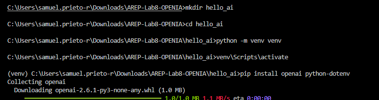
**Figura 1.** Creación del entorno virtual.

---

### 🔑 **2. Obtención de la llave de la API**

Se obtiene la **API Key** desde la cuenta de OpenAI, la cual será necesaria para autenticar las peticiones al modelo.

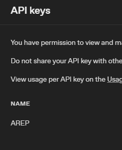
**Figura 2.** Obtención de la llave de la API desde OpenAI.

---

### ⚙️ **3. Configuración del archivo `.env`**

La clave de la API se almacena de forma segura en un archivo `.env` para proteger la información sensible.

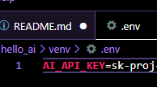
**Figura 3.** Inserción de la API Key en el archivo `.env`.

---

### 💻 **4. Primer Script con OpenAI**

Se crea un script básico en Python para realizar la primera interacción con el modelo de OpenAI, comprobando que todo funcione correctamente.

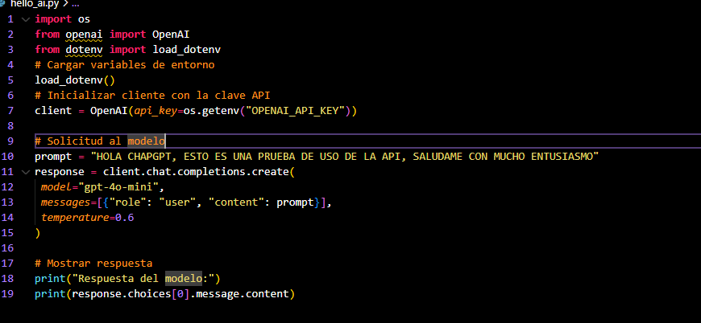
**Figura 4.** Primer script con conexión a la API de OpenAI.

---

### 🧱 **5. Verificación del entorno virtual**

Se verifica que el entorno virtual esté correctamente:

* Generado
* Activado
* Con todas las dependencias instaladas


**Figura 5.** Comprobación del entorno virtual y sus dependencias.

---

### 🤖 **6. Prueba de interacción con la IA**

Finalmente, se ejecuta una prueba para verificar que la IA responde correctamente con un mensaje de saludo.


**Figura 6.** Respuesta exitosa de la IA.

---

✅ **Resultado:**
Se logró crear y configurar correctamente el entorno de desarrollo, conectar con la API de OpenAI y ejecutar el primer script exitosamente.

---

## **Guía 2 - Hello World AI en Jupyter Notebook con VS Code**

---

### ⚙️ **1. Requisitos previos**

Antes de comenzar, se debe contar con **Jupyter** instalado en el entorno de desarrollo para ejecutar notebooks dentro de VS Code.


**Figura 1.** Instalación de Jupyter en VS Code.

---

### 📁 **2. Creación del entorno y estructura del proyecto**

Se crea una carpeta de trabajo y dentro de ella un entorno virtual dedicado para el laboratorio.


**Figura 2.** Creación de la carpeta del proyecto.

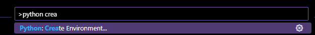
**Figura 3.** Creación del entorno virtual.

---

### 📦 **3. Instalación de dependencias**

Se instalan las dependencias necesarias para ejecutar el proyecto y conectar con la API de OpenAI.


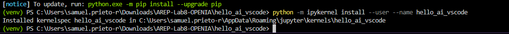
**Figura 4.** Instalación de dependencias en el entorno virtual.

---

### 🧮 **4. Instalación de dependencias desde el Notebook**

También es posible instalar las dependencias directamente desde una celda del archivo Jupyter Notebook.

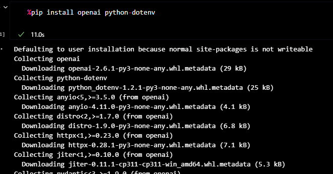
**Figura 5.** Instalación de dependencias desde el notebook.

---

### 🔑 **5. Configuración del archivo `.env`**

La clave de la API se almacena de forma segura en el archivo `.env`, al igual que en la guía anterior, para mantener la seguridad de la información sensible.


**Figura 6.** Inserción de la API Key en el archivo `.env`.

---

### 📓 **6. Ejecución del código en Jupyter Notebook**

En el archivo Jupyter Notebook, se ingresan y ejecutan los bloques de código para interactuar con la API de OpenAI directamente desde las celdas.

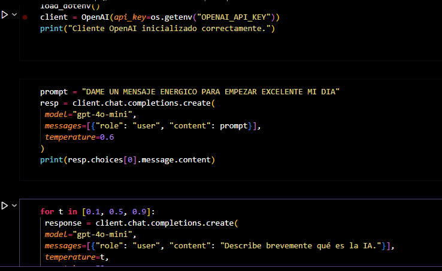
**Figura 7.** Ejecución del código en celdas del notebook.


**Figura 8.** Resultados exitosos de la ejecución del notebook.

---

✅ **Resultado:**
Se logró configurar correctamente **Jupyter Notebook** en VS Code, instalar las dependencias, cargar la API Key desde el archivo `.env` y ejecutar exitosamente un “Hello World” con la IA de OpenAI.

---

## **Guía 3 - Experimentación con Temperatura y Ejecuciones**

---

### 🧪 **1. Ejecución del programa**

En esta guía se realizan pruebas de ejecución del modelo con diferentes configuraciones y prompts.

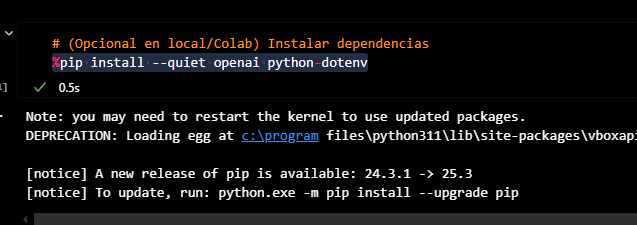
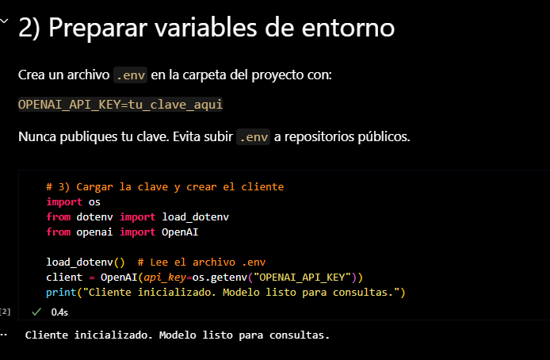
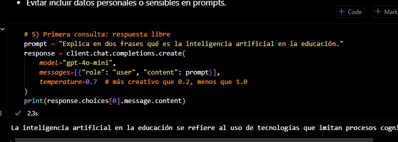
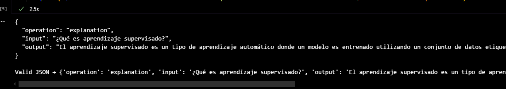
**Figuras 1-4.** Ejecución del modelo en diferentes escenarios.

---

### ⚙️ **2. Ejercicios con distintos valores de `temperature`**

Se evalúa la respuesta del modelo al variar el parámetro **temperature**, que controla el nivel de aleatoriedad y creatividad en las respuestas generadas.

---

#### 🔹 **Temperature = 0.1**

```json
{
  "prompt": "Explica brevemente el principio de funcionamiento de un árbol de decisión.",
  "respuesta": "Un árbol de decisión es un modelo de aprendizaje automático que utiliza una estructura jerárquica de nodos para representar decisiones y sus posibles consecuencias. Cada nodo interno representa una prueba sobre un atributo, cada rama representa el resultado de la prueba y cada nodo hoja representa una clase o resultado final, permitiendo así clasificar o predecir datos basados en características específicas."
}
```

---

#### 🔹 **Temperature = 0.5**

```json
{
  "prompt": "Explica brevemente el principio de funcionamiento de un árbol de decisión.",
  "respuesta": "Un árbol de decisión es un modelo de aprendizaje automático que utiliza una estructura jerárquica para tomar decisiones basadas en características de los datos. Cada nodo interno representa una prueba sobre una característica, cada rama representa el resultado de la prueba y cada hoja representa una decisión o clasificación final, permitiendo así una interpretación clara de las decisiones tomadas."
}
```

---

#### 🔹 **Temperature = 0.9**

```json
{
  "prompt": "Explica brevemente el principio de funcionamiento de un árbol de decisión.",
  "respuesta": "Un árbol de decisión es un modelo de aprendizaje automático que utiliza una estructura jerárquica de nodos para tomar decisiones basadas en preguntas sobre características de los datos. Cada nodo representa una pregunta sobre un atributo, donde las respuestas dividen los datos en subconjuntos, y el proceso continúa hasta alcanzar un resultado o una clase final."
}
```

---

✅ **Resultado:**
Se observó que al incrementar el valor de **temperature**, las respuestas se vuelven más variadas y creativas, mientras que con valores bajos tienden a ser más precisas y consistentes.

---

## **Guía 4 - Integración y Ejecución Completa**

---

### ⚙️ **1. Instalación de dependencias**

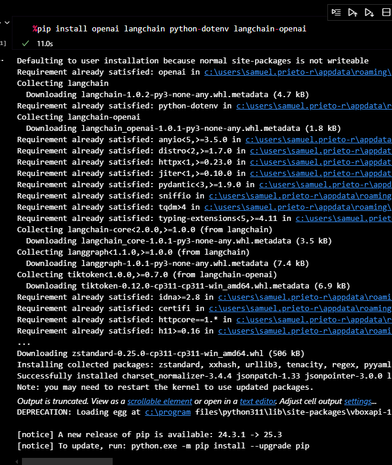
**Figura 1.** Instalación de dependencias requeridas para la ejecución final.

---

### 🚀 **2. Ejecución del programa**

Se realiza la ejecución completa del proyecto, validando el correcto funcionamiento de los scripts, el entorno virtual y la comunicación con la API de OpenAI.

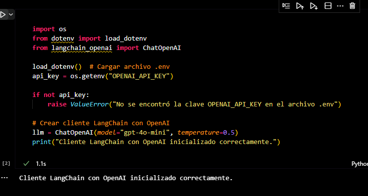
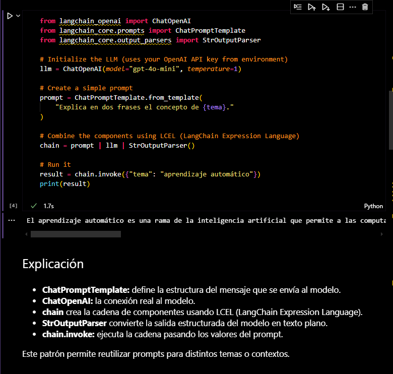
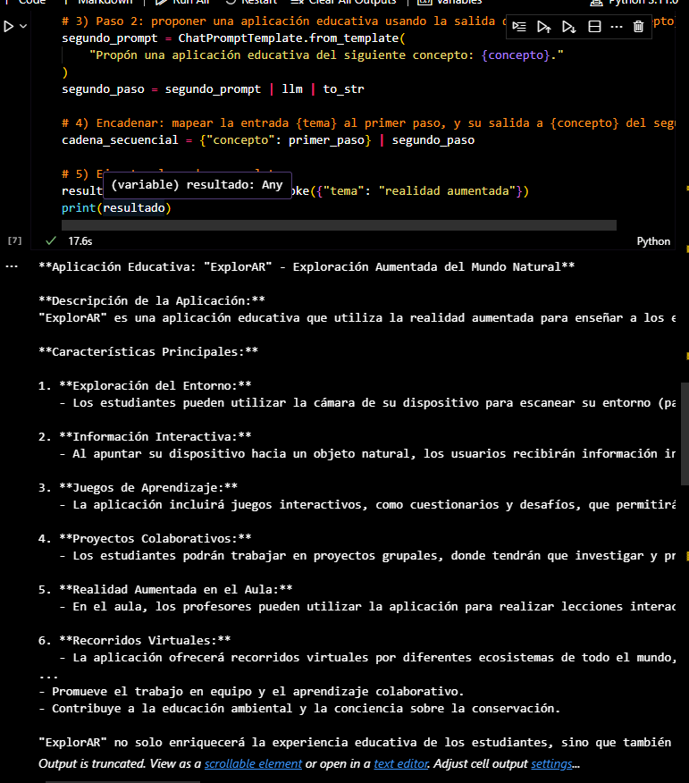
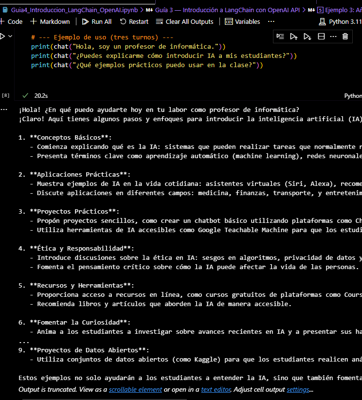
**Figuras 2-5.** Ejecución completa del laboratorio y resultados obtenidos.

---

✅ **Resultado Final:**
El laboratorio se completó con éxito. Se logró establecer comunicación con la API de OpenAI desde Python y Jupyter Notebook, realizar pruebas con diferentes configuraciones de temperatura y ejecutar el proyecto de manera integral en un entorno controlado.
